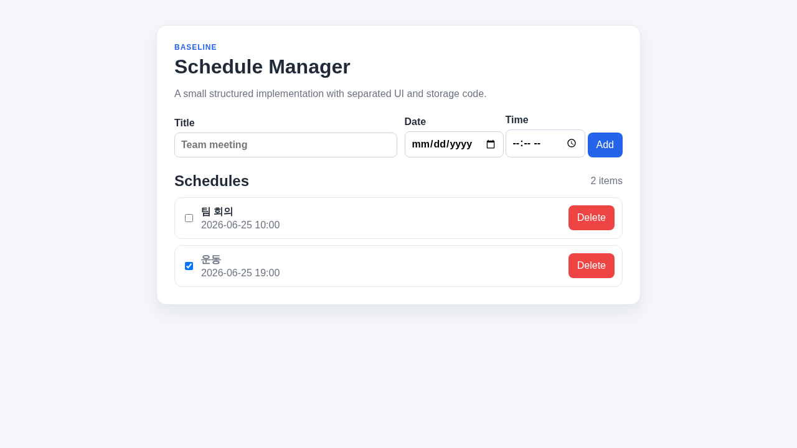
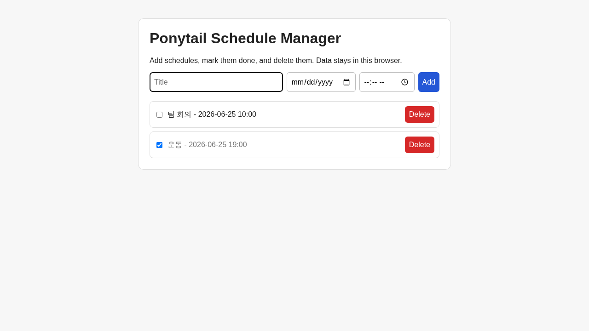
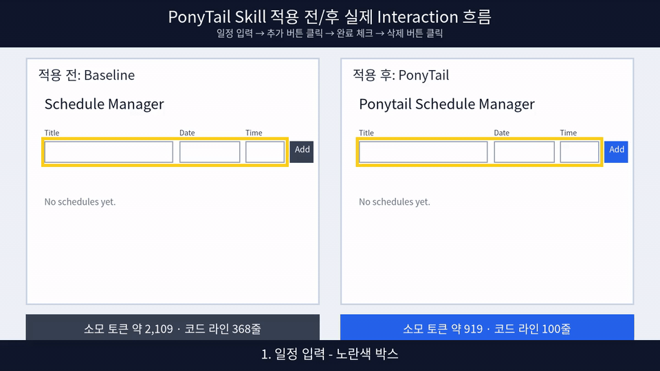

# Ponytail Skill Web Schedule Demo

AI 코딩 에이전트가 같은 웹 UI 요구사항을 구현할 때 결과가 어떻게 달라지는지 비교하는 데모 레포지토리입니다.

이 레포는 두 가지 구현을 나란히 보여줍니다.

1. `baseline/`: Ponytail skill/방식을 쓰지 않은 일반적인 AI 에이전트식 구현
2. `ponytail/`: Ponytail skill/방식을 적용해 지금 필요한 기능만 최소 구현한 버전

두 구현은 모두 직접 브라우저에서 테스트했고, 실제 비교 결과는 `comparison.md`, 테스트 결과는 `test-results.md`에 기록했습니다.

목표는 최고의 스케줄 관리 서비스를 만드는 것이 아닙니다. 간단한 웹 UI도 AI 에이전트에게 맡기면 파일 수, 코드량, 의존성, 구조가 불필요하게 커질 수 있다는 점을 보여주는 것입니다.

## 한눈에 보는 결과

| 구분 | Ponytail 미적용 baseline | Ponytail 적용 |
|---|---:|---:|
| 앱 파일 수 | 10개 | 1개 |
| 앱 코드 라인 수 | 368 lines | 100 lines |
| 외부 의존성 | 0개 | 0개 |
| 빌드 단계 | 없음 | 없음 |
| 구현 구조 | 컴포넌트/서비스/유틸 분리 | 단일 `index.html` |
| 브라우저 테스트 | Pass | Pass |

테스트한 기능:

- 일정 추가: Pass
- 일정 목록 조회: Pass
- 완료 처리: Pass
- 삭제: Pass
- 새로고침 후 `localStorage` 유지: Pass
- 브라우저 콘솔 JavaScript 오류: 0

## UI 캡처 비교

| Ponytail 미적용 baseline | Ponytail 적용 |
|---|---|
|  |  |

## 간단 사용 영상

GitHub README에서 바로 보이도록 MP4 링크만 두지 않고, 자동 재생되는 GIF를 먼저 배치했습니다.



일정 입력 → 추가 → 완료/삭제 흐름을 보여주는 짧은 사용 영상입니다. 하단의 소모 토큰은 실제 실행 로그가 아니라 앱 코드 파일을 `cl100k_base` tokenizer로 계산한 추정 코드 토큰입니다.

- [README 임베드용 MP4 보기](demo-videos/ponytail-before-after-usage-flow-embed.mp4)
- [PonyTail Skill 적용 전 사용 흐름](demo-videos/baseline-usage-flow.mp4)
  - PonyTail Skill 적용 전 (소모 토큰: 약 2,109 토큰, 총 코드 라인 수: 368줄)
- [PonyTail Skill 적용 후 사용 흐름](demo-videos/ponytail-usage-flow.mp4)
  - PonyTail Skill 적용 후 (소모 토큰: 약 919 토큰, 총 코드 라인 수: 100줄)

두 화면은 같은 기능을 제공합니다. 차이는 사용자 기능보다 구현 방식에 있습니다.

- baseline은 여러 파일로 나뉜 일반적인 AI 에이전트식 구조입니다.
- ponytail은 같은 기능을 단일 HTML 파일로 끝낸 최소 구현입니다.

## 왜 스케줄 관리 앱인가?

스케줄 관리 앱은 누구나 이해하기 쉬운 주제이지만, 웹 UI에서 필요한 기본 동작을 모두 포함합니다.

- 일정 추가
- 일정 목록 조회
- 완료 처리
- 삭제
- `localStorage`를 이용한 브라우저 저장

그래서 파일 수, 코드량, 의존성, 실행 방식, 추상화 정도를 비교하기 좋은 작은 데모입니다.

## baseline 버전 실행 방법

```bash
cd baseline
python3 -m http.server 8000
```

브라우저에서 다음 주소를 엽니다.

```text
http://localhost:8000
```

baseline 버전은 브라우저 기본 JavaScript 모듈을 사용하며, 설치 과정은 필요 없습니다. 다만 컴포넌트, 서비스, 유틸 파일을 분리해 일반적인 AI 에이전트식 구조화가 드러나도록 했습니다.

## ponytail 버전 실행 방법

```bash
cd ponytail
python3 -m http.server 8001
```

브라우저에서 다음 주소를 엽니다.

```text
http://localhost:8001
```

또는 `ponytail/index.html` 파일을 브라우저에서 직접 열어도 됩니다.

Ponytail 버전은 단일 HTML 파일로 동작하며 외부 의존성, 빌드 도구, 프레임워크를 사용하지 않습니다.

## 비교 기준

- 파일 수
- 코드 라인 수
- 외부 의존성 수
- 빌드 필요 여부
- 실행 방법의 단순성
- UI 복잡도
- 상태 관리 복잡도
- 불필요한 컴포넌트 분리
- 불필요한 추상화
- 요구사항 외 기능 포함 여부
- 기능 요구사항 충족 여부
- 사람이 빠르게 이해할 수 있는지
- 수정 난이도

## 이 레포에서 얻을 수 있는 인사이트

간단한 웹 UI도 AI 에이전트가 미래 확장성을 과하게 예상하면 필요 이상의 파일과 구조가 생길 수 있습니다.

Ponytail 방식은 지금 필요한 화면과 기능만 구현하게 만들어 검토할 코드량을 줄이고, 실행 방법을 단순하게 만들며, 사람이 더 빠르게 이해하고 수정할 수 있는 결과를 만듭니다.
